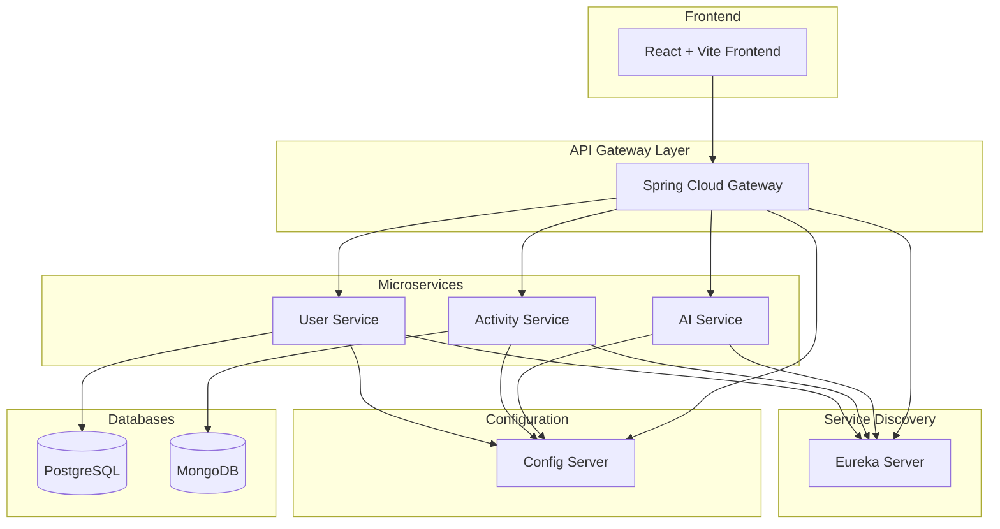

# 🏋️‍♂️ Fitness Microservices Platform


**A modern, scalable fitness tracking application built with cloud-native microservices architecture**

[🚀 Getting Started](#-getting-started) • [📋 Features](#-features) • [🏗️ Architecture](#️-architecture) • [📖 API Documentation](#-api-documentation) • [🤝 Contributing](#-contributing)

</div>

---

## 📋 Features

### 🎯 Core Functionality
- **User Management** - Complete user registration, authentication, and profile management
- **Activity Tracking** - Log workouts, track progress, and monitor fitness metrics
- **AI Recommendations** - Personalized workout suggestions powered by machine learning
- **Real-time Analytics** - Live dashboard with fitness statistics and insights
- **Social Features** - Share achievements and connect with fitness community

### 🔧 Technical Highlights
- **Microservices Architecture** - Scalable, maintainable, and independently deployable services
- **Service Discovery** - Automatic service registration and discovery with Netflix Eureka
- **API Gateway** - Centralized routing, authentication, and rate limiting
- **Configuration Management** - Externalized configuration with Spring Cloud Config
- **Responsive UI** - Modern React frontend with Vite for lightning-fast development

---

## 🏗️ Architecture

### System Overview


### 📁 Project Structure
```
fitness-microservices/
├── 🔧 configserver/           # Centralized configuration management
├── 🌐 eureka/                 # Service discovery server
├── 🚪 gateway/                # API Gateway & routing
├── 👥 userservice/            # User management & authentication
│   ├── 📊 Database: PostgreSQL/H2
│   └── 🔐 Features: Auth, Profiles, Preferences
├── 🏃 activityservice/        # Activity tracking & analytics
│   ├── 📊 Database: MongoDB
│   └── 📈 Features: Workouts, Progress, Statistics
├── 🤖 aiservice/              # AI-powered recommendations
│   └── 🧠 Features: ML Models, Personalization
└── 🎨 fitness-app-frontend/   # React + Vite frontend
    └── ⚡ Features: Dashboard, Tracking, Social
```

---

## 🚀 Getting Started

### Prerequisites

Make sure you have the following installed:

| Tool | Version | Purpose |
|------|---------|---------|
| ☕ **Java** | 17+ | Backend services |
| 🟢 **Node.js** | 18+ | Frontend development |
| 📦 **Maven** | 3.8+ | Build automation |
| 🍃 **MongoDB** | 5.0+ | Activity data storage |
| 🐳 **Docker** | 20+ | Containerization (optional) |

### 🎯 Quick Start

#### 1️⃣ Clone & Setup
```bash
git clone https://github.com/yourusername/fitness-microservices.git
cd fitness-microservices
```

#### 2️⃣ Start Infrastructure Services
```bash
# Terminal 1: Configuration Server
cd configserver
./mvnw spring-boot:run

# Terminal 2: Service Discovery
cd eureka
./mvnw spring-boot:run
```

Wait for services to start (check Eureka dashboard at http://localhost:8761)

#### 3️⃣ Start Application Services
```bash
# Terminal 3: User Service
cd userservice
./mvnw spring-boot:run

# Terminal 4: Activity Service  
cd activityservice
./mvnw spring-boot:run

# Terminal 5: AI Service
cd aiservice
./mvnw spring-boot:run

# Terminal 6: API Gateway
cd gateway
./mvnw spring-boot:run
```

#### 4️⃣ Start Frontend
```bash
# Terminal 7: React Frontend
cd fitness-app-frontend
npm install
npm run dev
```

### 🌐 Access Points

| Service | URL | Purpose |
|---------|-----|---------|
| 🎨 **Frontend** | http://localhost:5173 | Main application UI |
| 🚪 **API Gateway** | http://localhost:8080 | API endpoints |
| 🌐 **Eureka Dashboard** | http://localhost:8761 | Service registry |
| 🔧 **Config Server** | http://localhost:8888 | Configuration management |

---

## 🐳 Docker Deployment

### Quick Docker Setup
```bash
# Build all services
docker-compose build

# Start the entire stack
docker-compose up -d

# View logs
docker-compose logs -f

# Stop services
docker-compose down
```

### Environment Variables
Create a `.env` file in the root directory:
```env
# Database Configuration
MONGODB_URI=mongodb://localhost:27017/fitness
POSTGRES_URL=jdbc:postgresql://localhost:5432/fitness_users

# Service Ports
CONFIG_SERVER_PORT=8888
EUREKA_SERVER_PORT=8761
GATEWAY_PORT=8080
USER_SERVICE_PORT=8081
ACTIVITY_SERVICE_PORT=8082
AI_SERVICE_PORT=8083

# Frontend
VITE_API_BASE_URL=http://localhost:8080
```

---

## 📖 API Documentation

### 🔐 Authentication Endpoints
```http
POST /api/auth/register    # User registration
POST /api/auth/login       # User authentication
POST /api/auth/refresh     # Token refresh
```

### 👥 User Management
```http
GET    /api/users/profile     # Get user profile
PUT    /api/users/profile     # Update profile
DELETE /api/users/account     # Delete account
```

### 🏃 Activity Tracking
```http
GET    /api/activities           # List user activities
POST   /api/activities           # Log new activity
PUT    /api/activities/{id}      # Update activity
DELETE /api/activities/{id}      # Delete activity
GET    /api/activities/stats     # Get statistics
```

### 🤖 AI Recommendations
```http
GET /api/ai/recommendations     # Get personalized recommendations
GET /api/ai/insights           # Get fitness insights
```

---

## 🧪 Testing

### Unit Tests
```bash
# Run all tests
./mvnw test

# Run tests for specific service
cd userservice && ./mvnw test
```

### Integration Tests
```bash
# Run integration tests
./mvnw verify -P integration-tests
```

### Frontend Tests
```bash
cd fitness-app-frontend
npm run test
```

---

## 🔍 Monitoring & Health Checks

### Health Endpoints
Each service exposes health information:
- **Health Check**: `/actuator/health`
- **Metrics**: `/actuator/metrics`
- **Info**: `/actuator/info`

### Service Status
Check service registration status on Eureka Dashboard: http://localhost:8761

---

## 🚀 Performance & Scaling

### Load Testing
```bash
# Install Apache Bench
sudo apt-get install apache2-utils

# Test API Gateway
ab -n 1000 -c 10 http://localhost:8080/api/activities
```

### Scaling Services
```bash
# Scale specific service with Docker
docker-compose up --scale userservice=3

# Or run multiple instances manually
java -jar -Dserver.port=8084 userservice/target/userservice.jar
```

---

## 🛠️ Development

### Code Style
This project follows:
- **Java**: Google Java Style Guide
- **JavaScript**: Airbnb JavaScript Style Guide
- **Commits**: Conventional Commits

### Pre-commit Hooks
```bash
# Install pre-commit hooks
npm install -g husky
npx husky install
```

### Hot Reload Development
```bash
# Backend: Use Spring Boot DevTools
./mvnw spring-boot:run -Dspring-boot.run.profiles=dev

# Frontend: Vite HMR is enabled by default
npm run dev
```

---

## 🤝 Contributing

We welcome contributions! Please see our [Contributing Guide](CONTRIBUTING.md) for details.

### Development Workflow
1. 🍴 **Fork** the repository
2. 🌿 **Create** a feature branch: `git checkout -b feature/amazing-feature`
3. 💾 **Commit** your changes: `git commit -m 'feat: add amazing feature'`
4. 📤 **Push** to the branch: `git push origin feature/amazing-feature`
5. 🔄 **Open** a Pull Request

### Commit Convention
```
feat: add new feature
fix: bug fix
docs: documentation changes
style: formatting changes
refactor: code refactoring
test: adding tests
chore: maintenance tasks
```

---

## 🐛 Troubleshooting

### Common Issues

<details>
<summary>🔴 Service won't start</summary>

**Problem**: Service fails to start with port binding error

**Solution**:
```bash
# Check if port is in use
netstat -tulpn | grep :8080

# Kill process using port
kill -9 $(lsof -t -i:8080)
```
</details>

<details>
<summary>🔴 Services can't connect to Eureka</summary>

**Problem**: Services not registering with Eureka

**Solution**:
1. Ensure Eureka server is running first
2. Check `application.yml` configuration
3. Verify network connectivity
</details>

<details>
<summary>🔴 Frontend can't connect to backend</summary>

**Problem**: CORS or network issues

**Solution**:
1. Check API Gateway is running
2. Verify CORS configuration
3. Check `VITE_API_BASE_URL` in `.env`
</details>

---

## 📄 License

This project is licensed under the **MIT License** - see the [LICENSE](LICENSE) file for details.

---

## 🙏 Acknowledgments

- [Spring Boot](https://spring.io/projects/spring-boot) - Application framework
- [React](https://reactjs.org/) - Frontend library
- [Vite](https://vitejs.dev/) - Build tool
- [Netflix Eureka](https://github.com/Netflix/eureka) - Service discovery

---

<div align="center">

**Built with ❤️ by the Fitness Team**

[⭐ Star this repo](https://github.com/yourusername/fitness-microservices) • [🐛 Report Bug](https://github.com/yourusername/fitness-microservices/issues) • [💡 Request Feature](https://github.com/yourusername/fitness-microservices/issues)

</div>
